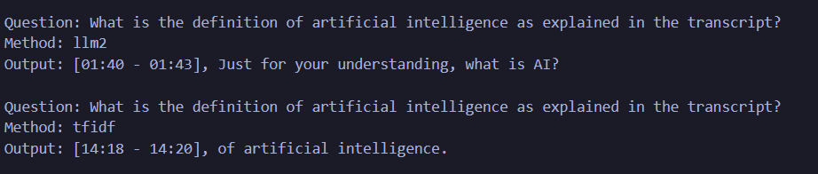
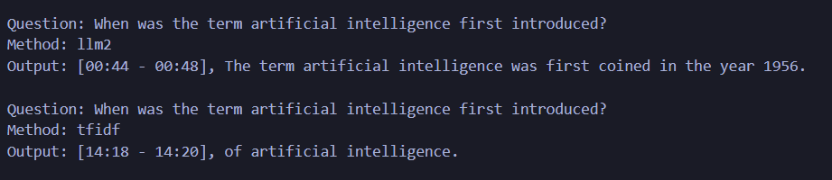
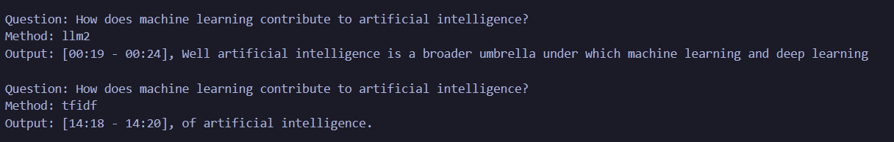
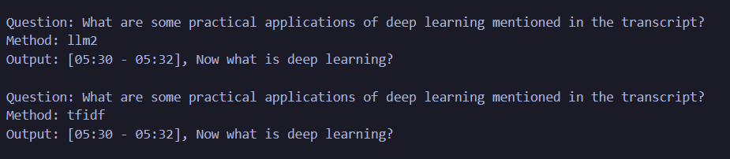
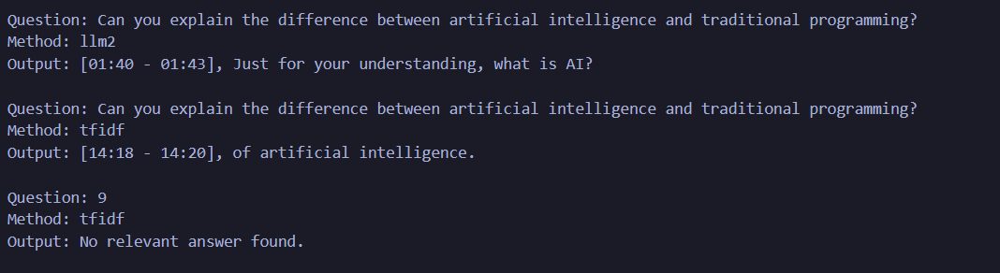

# Semantic Search for Transcript Q&A

A Python-based semantic search system to find relevant transcript chunks based on user queries. Supports TF-IDF and Hugging Face LLM (llm2) search methods, with a Streamlit web interface and CLI for interactive querying. Outputs results in the format `[timestamp], <chunk>` and logs them to `output/output.txt`.







## Features

- **Two Search Methods**:
  - **TF-IDF**: Keyword-based search using scikit-learn's TfidfVectorizer.
  - **Hugging Face LLM (llm2)**: Semantic search using sentence-transformers (`all-MiniLM-L6-v2`).
- **Web Interface**: Streamlit app (`app.py`) for uploading transcripts and querying.
- **CLI**: Interactive command-line interface (`transcript.py`) for querying.
- **Output Logging**: Saves queries and results to `output/output.txt` in the format:
  ```
  Question: What is artificial intelligence?
  Method: tfidf
  Output: [00:41 - 00:44], So let's start with artificial intelligence.
  ```
- **Transcript Format**: Supports `[MM:SS - MM:SS] text` format.

- **OPENAI API**: This approach wasn't applied as I don't have any api key for that, although i do have an api key of gemini but I dont't know the code wasn't running. So I removed the search_llm1/py method but below is the implementation

```python
import numpy as np
from sklearn.metrics.pairwise import cosine_similarity
from langchain_google_genai import GoogleGenerativeAIEmbeddings
from utils_transcript import TranscriptLoader

class GeminiSearcher:
    def __init__(self, chunks, timestamps, model_name="models/  embedding-001"):
        """
        Initialize Gemini searcher with transcript chunks.

        Args:
            chunks (list): List of text chunks.
            timestamps (list): List of corresponding timestamps.
            model_name (str): Gemini embedding model name.
        """
        self.chunks = chunks
        self.timestamps = timestamps
        self.model_name = model_name
        self.embeddings = None
        self.MIN_WORDS = 3
        self.loader = TranscriptLoader("")  # For clean_text method only
        self._load_model_and_embed()

    def _load_model_and_embed(self):
        """Load Gemini embedding model and create embeddings."""
        print(f"Loading Gemini model: {self.model_name}")

        try:
            # Initialize Gemini embeddings
            self.model = GoogleGenerativeAIEmbeddings(model=self.model_name)

            # Filter chunks by minimum word count
            self.filtered_indices = [i for i, ch in enumerate(self.chunks)
                                   if len(self.loader.clean_text(ch).split()) >= self.MIN_WORDS]
            self.filtered_chunks = [(self.timestamps[i], self.chunks[i])
                                  for i in self.filtered_indices]

            if not self.filtered_chunks:
                print("Warning: No chunks meet minimum word count.")
                return

            # Create embeddings for filtered chunks
            print("Creating embeddings for transcript chunks...")
            chunk_texts = [self.loader.clean_text(ch) for _, ch in self.filtered_chunks]
            self.embeddings = self.model.embed_documents(chunk_texts)
            self.embeddings = np.array(self.embeddings)
            print(f"Created embeddings with shape: {self.embeddings.shape}")

        except Exception as e:
            print(f"Error loading Gemini model or creating embeddings: {e}")
            self.embeddings = None

    def search(self, query, top_k=1, similarity_threshold=0.3):
        """
        Search for the most relevant chunk using Gemini embeddings.

        Args:
            query (str): User question.
            top_k (int): Number of top results to return.
            similarity_threshold (float): Minimum similarity score.

        Returns:
            tuple: (timestamp, chunk) of most relevant chunk, or None.
        """
        if not query.strip():
            return None

        if self.embeddings is None or not self.filtered_chunks:
            print("Error: Embeddings not initialized or no valid chunks.")
            return None

        try:
            # Preprocess and embed query
            query = self.loader.clean_text(query)
            query_embedding = np.array(self.model.embed_query(query)).reshape(1, -1)

            # Calculate cosine similarity
            embeddings = np.array(self.embeddings)
            similarities = cosine_similarity(query_embedding, embeddings).flatten()

            # Debug: Print similarities
            print("Gemini Similarities:", [(ts, f"{score:.4f}")
                                       for (ts, _), score in zip(self.filtered_chunks, similarities)])

            # Get top match
            top_indices = np.argsort(similarities)[::-1][:top_k]
            best_idx = top_indices[0]
            best_score = similarities[best_idx]

            if best_score < similarity_threshold:
                print(f"No relevant chunk found (score: {best_score:.2f})")
                return None

            print(f"Best match similarity: {best_score:.4f}")
            return self.filtered_chunks[best_idx]

        except Exception as e:
            print(f"Error during Gemini search: {e}")
            return None
```

## Approach

The system processes transcript files by:

1. **Loading and Chunking**: `utils.py` parses transcripts into timestamped chunks using regex, cleaning text for consistency.
2. **Search Methods**:
   - **TF-IDF**: Builds a vector index of chunks, using cosine similarity to match queries.
   - **Hugging Face LLM**: Encodes chunks into embeddings, using semantic similarity for matching.
3. **Interfaces**:
   - **CLI**: Interactive loop in `transcript.py` for querying and logging.
   - **Web**: Streamlit interface in `app.py` for file uploads and querying.
4. **Output**: Returns the most relevant chunk as `[timestamp], <chunk>`, logged to `output/output.txt`.

## Dependencies

- Python 3.8+
- Required packages (listed in `requirements.txt`):
  ```
  scikit-learn==1.5.2
  sentence-transformers==3.1.1
  streamlit==1.39.0
  torch==2.4.1
  numpy==1.26.4
  ```

## Installation

1. **Clone the Repository**:

   ```bash
   git clone https://github.com/your-repo/semantic-search-transcript.git
   cd semantic-search-transcript
   ```

2. **Create Virtual Environment**:

   ```bash
   python -m venv venv
   source venv/bin/activate  # On Windows: venv\Scripts\activate
   ```

3. **Install Dependencies**:
   ```bash
   pip install -r requirements.txt
   ```

## Project Structure

```
semantic-search-transcript/
├── src/
│   ├── transcript.py        # CLI entry point
│   ├── utils.py            # Transcript loading and preprocessing
│   ├── search_tfidf.py     # TF-IDF search implementation
│   ├── search_hf.py        # Hugging Face LLM search implementation
├── data/
│   └── transcript.txt      # Sample transcript file
├── output/
│   ├── output.txt          # Search results log
│   └── screenshots/        # Screenshots (optional)
├── app.py                  # Streamlit web interface
├── requirements.txt        # Dependencies
├── README.md               # This file
```

## Usage

### 1. CLI Interface (`transcript.py`)

Run the CLI to query a transcript file interactively.

**Command**:

```bash
python src/transcript.py data/transcript.txt <method>
```

- Replace `<method>` with `tfidf` or `llm2`.

**Example**:

```bash
python src/transcript.py data/transcript.txt tfidf
```

**Steps**:

1. At the prompt (`Transcript loaded, please ask your question (press 8 for exit):`), enter a question, e.g., `What is artificial intelligence?`.
2. View results, e.g., `[00:41 - 00:44], So let's start with artificial intelligence.`.
3. Press `8` to exit.
4. Check `output/output.txt` for logged results.

### 2. Web Interface (`app.py`)

Run the Streamlit app for a browser-based interface.
Link : *https://semanticsearchtranscript.streamlit.app*

**Command**:

```bash
streamlit run app.py
```

**Steps**:

1. Open `http://localhost:8501` in your browser.
2. Upload `data/transcript.txt`.
3. Select a search method (`TF-IDF` or `Hugging Face LLM (llm2)`).
4. Enter a question, e.g., `What is artificial intelligence?`.
5. Click `Search` to view results.
6. Check `output/output.txt` for logged results.

## Testing

### Sample Questions

Test the following questions to verify functionality:

1. What is the definition of artificial intelligence as explained in the transcript?
2. When was the term artificial intelligence first introduced?
3. How does machine learning contribute to artificial intelligence?
4. What are some practical applications of deep learning mentioned in the transcript?
5. Can you explain the difference between artificial intelligence and traditional programming?

### Expected Outputs

- For `What is artificial intelligence?`:
  ```
  [00:41 - 00:44], So let's start with artificial intelligence.
  ```
- For `When was AI first coined?`:
  ```
  [00:44 - 00:48], The term artificial intelligence was first coined in the year 1956.
  ```

### Verification

- **CLI**: Run with both methods, check console output and `output/output.txt`.
- **Web**: Test both methods, capture screenshots, and verify `output/output.txt`.
- **Logs**: Ensure `output/output.txt` contains:
  ```
  Question: What is artificial intelligence?
  Method: tfidf
  Output: [00:41 - 00:44], So let's start with artificial intelligence.
  ```

## License

copyright issued by Aditya Arya

---

## Contact

For questions or issues, please open a GitHub issue or contact *arya050411@gmail.com*.

---

_Developed by Aditya Arya._
